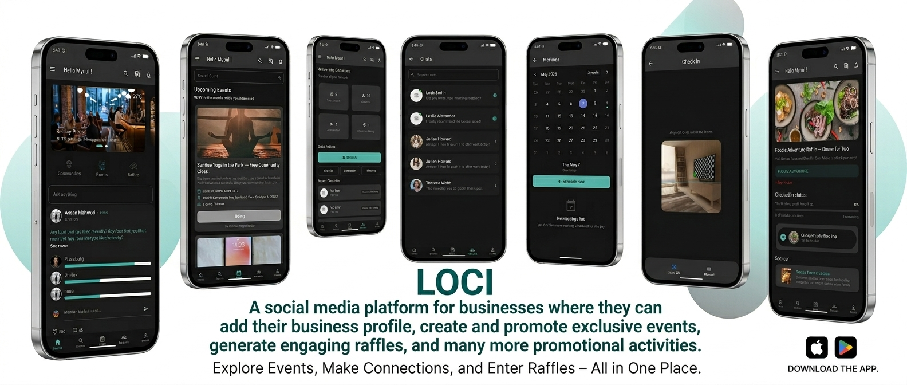

# Loci – Social Media Platform for Businesses

## Overview

Loci is a dynamic social media ecosystem designed specifically for businesses to connect with their community. It allows business owners to create profiles, promote exclusive events, generate engaging raffles, and handle real-time networking—all within a seamless mobile experience.

## Key Features

- Business Profiles: Dedicated spaces for businesses to showcase their brand, location, and services.
- Event Management: Create, promote, and manage exclusive community events.
- Interactive Raffles: Generate engagement through digital raffles and promotional activities.
- Real-time Communication: Instant messaging between businesses and users powered by WebSockets.
- Live Map Integration: Discover local businesses and events through an interactive map interface.
- Networking Dashboard: Overview of contacts, referrals, and upcoming meetings.
- Secure Authentication: Robust user and business verification using JWT.

## Technology Stack

### Frontend
- Dart
- Flutter
- GetX (State Management)
- GetStorage (Local Storage)

### Backend
- Node.js
- Express.js
- MongoDB
- Socket.io
- JSON Web Tokens (JWT)
