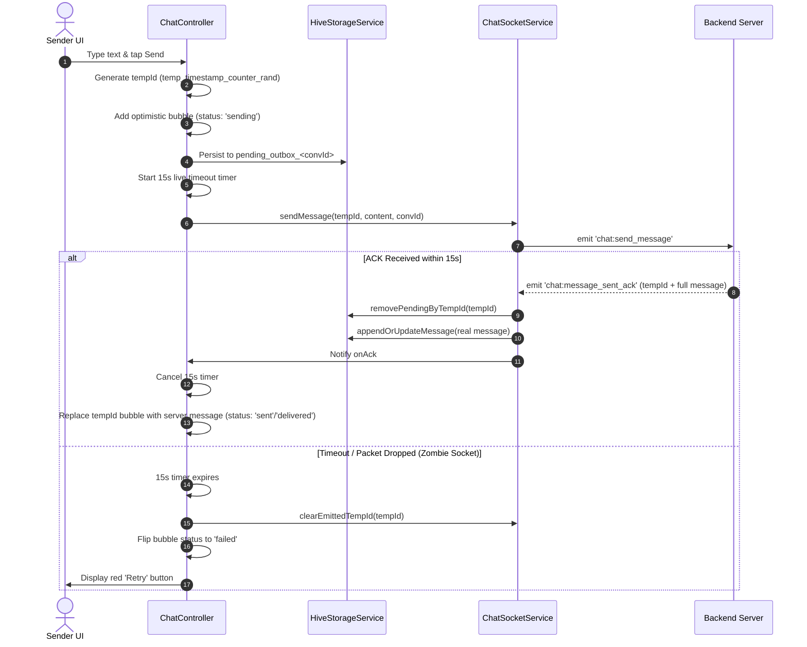

# Chat Architecture, Offline-First Flow & Backend Specification

This document provides a comprehensive technical overview of the real-time chat architecture in the Loci application, covering local storage with Hive, reactive network state management, Socket.io event lifecycle, offline queueing, and backend requirements.

---

## 1. High-Level Architecture Overview

The chat system is built on an **Offline-First, Optimistic UI Architecture**:
* **Transport Layer:** WebSocket-only Socket.io client (`ChatSocketService`).
* **Local Persistence Layer:** Synchronous, in-memory Hive boxes (`HiveStorageService`).
* **Network Reactivity Layer:** Real-time connectivity monitor (`ConnectivityService`).
* **Presentation State Layer:** GetX Controllers (`ChatController` for active threads, `ChatListController` for conversation feeds).

```
┌─────────────────────────────────────────────────────────────┐
│                       Flutter UI                            │
│           (MessageScreen / ChatListScreen)                  │
└──────────────┬───────────────────────────────▲──────────────┘
               │ (1) User sends msg            │ (5) UI updates
               ▼                               │
┌──────────────────────────────┐ ┌─────────────┴──────────────┐
│       ChatController         │ │      ChatListController    │
│  - Optimistic UI bubble      │ │  - Conversation preview    │
│  - 15s Timeout & Tap-to-Retry│ │  - Unread count badges     │
│  - Chronological Sorting     │ │  - User presence dots      │
└──────────────┬───────────────┘ └─────────────▲──────────────┘
               │ (2) Add outbox                │ (4) Emit stream
               ▼                               │
┌──────────────────────────────┐ ┌─────────────┴──────────────┐
│     HiveStorageService       │ │     ChatSocketService      │
│  - chat_storage_box          │ │  - Global persistent socket│
│  - pending_outbox_<convId>   │ │  - Strict FIFO Auto-Flush  │
│  - Frame-0 Sync Reads (0ms)  │ │  - ACK Waiter & Timeout    │
└──────────────┬───────────────┘ └─────────────▲──────────────┘
               │ (3) Read queue                │
               └───────────────────────────────┘
```

---

## 2. Hive Database Structure & Caching Strategy

All chat data is cached locally using **Hive in-memory boxes** to ensure **0ms Frame-0 rendering** when entering screens.

### Box: `chat_storage_box`

| Key / Prefix | Data Type | Description | Limit / Policy |
| :--- | :--- | :--- | :--- |
| `cached_conversations` | `List<Map<String, dynamic>>` | List of user conversations serialized as JSON. | Trimmed to max **20 conversations** (FIFO). |
| `cached_messages_<convId>` | `List<Map<String, dynamic>>` | Confirmed server messages for a given chat room. | Trimmed to latest **20 messages** (FIFO). |
| `pending_outbox_<convId>` | `List<Map<String, dynamic>>` | Pending / unsent messages waiting for server ACK. | Persisted until server ACK is confirmed. |
| `known_conv_ids` | `List<String>` | Tracked conversation IDs stored in Hive. | Maintained automatically on inserts/deletions. |
| `pending_outbox_conv_ids` | `List<String>` | Conversation IDs that have active outbox queues. | Used by global flusher to locate unsent items. |

### Box Isolation Rules:
1. **Confirmed vs. Optimistic:** Confirmed messages live in `cached_messages_<convId>`, while optimistic/pending bubbles live in `pending_outbox_<convId>`.
2. **Privacy Wipe:** Calling `HiveStorageService.wipeOnLogout()` atomically clears all boxes upon user logout.

---

## 3. Online & Offline Lifecycle

### 3.1 Going Offline
1. `ConnectivityService` detects network loss via `connectivity_plus` and sets `isOnline.value = false`, `isOffline.value = true`.
2. `ChatSocketService` disconnects the active socket.
3. Controllers activate the **Fast Offline Guard** (`ConnectivityService.isCurrentOffline`), instantly short-circuiting REST API calls and pagination spinners.

### 3.2 Reconnecting (From Any Screen)
1. `ConnectivityService` detects network restoration and fires the `onReconnect` stream.
2. `ChatSocketService` (a global app-wide permanent service) triggers `connect()`.
3. As soon as the socket establishes a connection (`onConnect` / `onReconnect`):
   - **Global Outbox Flush:** Calls `flushGlobalOutbox()`, which scans all pending messages across all conversation boxes in Hive and sends them sequentially.
   - **Room Re-Join:** If a chat room is currently open on screen, `ChatController` re-emits `chat:join_conversation` and performs a silent background REST fetch (`loadMessages(silent: true)`) to reconcile any missed messages.

---

## 4. End-to-End Message Sending Flow

### Scenario A: Sending When Online (Live Send)



### Scenario B: Sending When Offline (Queued Outbox Send)

1. User sends message while disconnected.
2. Optimistic bubble appears on screen with `status: 'sending'`.
3. Message is safely written to Hive under `pending_outbox_<convId>`.
4. Socket emit is skipped because `!isConnected`.
5. When internet returns (regardless of whether the user is on Home, Profile, or Chat screen):
   - `flushGlobalOutbox()` executes on `ChatSocketService`.
   - Outbox messages are processed in strict **FIFO sequence** (one by one).
   - For each message, the client emits `chat:send_message` with `tempId` and pauses (`await _waitForAck(tempId)`) until the server responds with `chat:message_sent_ack`.
   - Once ACKed, the message is removed from the outbox and the next queued message is sent.

---

## 5. Network Resilience & Edge Case Handling

### 5.1 Zombie Sockets & 15-Second Live Timeout
* **Problem:** On cellular networks, signal loss may drop TCP packets without sending a disconnect signal. The socket appears "connected", but emits are lost in a black hole.
* **Client Solution:** Every live message starts a 15-second timer. If no ACK arrives in 15 seconds, the message transitions to `status: 'failed'` and its `tempId` is unlocked from the socket tracking set.
* **User Recovery:** The user can tap the red **Retry** button, which re-sends the message using the exact same `tempId`.

### 5.2 Server Idempotency on `tempId`
* **Problem:** If the server saves a message and emits an ACK, but the downlink ACK is lost on mobile data, the client will retry sending the same `tempId`.
* **Backend Solution:** The backend caches/checks `tempId` for 5 minutes. If a duplicate `tempId` arrives, the backend does **not** insert a second row; it simply re-emits the original `chat:message_sent_ack`.

### 5.3 Chronological Sorting (Jitter Protection)
* All message lists in `ChatController` are sorted chronologically by `createdAt` in `_deduplicateMessages()`.
* Out-of-order socket packets or mixed REST responses are automatically displayed in the correct chronological order.

### 5.4 UTC Timestamp Normalization
* Optimistic client timestamps are formatted using standard UTC ISO-8601 strings: `DateTime.now().toUtc().toIso8601String()` (e.g., `"2026-08-17T06:30:00.000Z"`), ensuring accurate sorting against server timestamps.

---

## 6. Socket.io Event Contracts

### 6.1 Outgoing Events (Client → Server)

| Event Name | Description | Payload |
| :--- | :--- | :--- |
| `chat:join_conversation` | Joins the real-time room for a conversation. | `"conversationId"` (string) |
| `chat:leave_conversation` | Leaves the room when closing the thread. | `"conversationId"` (string) |
| `chat:send_message` | Sends a new text message. | `{ conversationId?, recipientId?, content, replyTo?, tempId? }` |
| `chat:mark_read` | Marks a conversation as read by current user. | `{ conversationId: string }` |
| `chat:typing_start` | Notifies that the user started typing. | `{ conversationId: string, isTyping: true }` |
| `chat:typing_stop` | Notifies that the user stopped typing. | `{ conversationId: string, isTyping: false }` |
| `chat:edit_message` | Edits an existing message (within 24h). | `{ messageId: string, content: string }` |
| `chat:delete_message` | Deletes a message (unsend or delete for me). | `{ messageId: string, forEveryone: boolean }` |
| `chat:react_message` | Adds or changes an emoji reaction. | `{ messageId: string, emoji: string }` |
| `chat:unreact_message` | Removes user's emoji reaction. | `{ messageId: string }` |

---

### 6.2 Incoming Events (Server → Client)

| Event Name | Trigger & Description | Expected Payload Format |
| :--- | :--- | :--- |
| `chat:message_sent_ack` | Sent to **sender** after message is saved. | `{ "tempId": "temp_...", "message": { "id": "...", "conversationId": "...", "sender": { ... }, "content": "...", "status": "sent" \| "delivered", "createdAt": "...", "canUnsend": true, "canEdit": true, ... } }` |
| `chat:message_received` | Broadcast to **recipients** in the room. | `{ "message": { "id": "...", "conversationId": "...", "sender": { ... }, "content": "...", "status": "sent", "createdAt": "...", ... } }` |
| `chat:messages_read` | Recipient read the conversation. | `{ "conversationId": "...", "userId": "..." }` |
| `chat:message_delivered` | Recipient came online / joined room. | `{ "conversationId": "...", "userId": "..." }` |
| `chat:typing` | Counterpart typing status updated. | `{ "conversationId": "...", "userId": "...", "isTyping": boolean }` |
| `chat:message_edited` | Message was edited by its author. | `{ "message": { "id": "...", "content": "...", "isEdited": true, ... } }` |
| `chat:message_deleted` | Message was unsent / deleted. | `{ "messageId": "...", "conversationId": "...", "forEveryone": boolean }` |
| `chat:message_reaction_updated` | Reactions updated on a message. | `{ "messageId": "...", "reactions": [ { "userId": "...", "emoji": "..." } ] }` |
| `chat:user_online` | User connected to socket. | `{ "userId": "..." }` |
| `chat:user_offline` | User disconnected from socket. | `{ "userId": "...", "lastSeen": "..." }` |
| `chat:error` | Action rejected by server rule. | `{ "message": "User-facing error message" }` |

---

## 7. REST API Endpoints

| Method | Endpoint | Purpose |
| :--- | :--- | :--- |
| `GET` | `/conversations?page=1&limit=20` | Loads paginated conversations list. |
| `GET` | `/conversations/:id/messages?limit=30&before=:cursor` | Loads paginated message history (cursor-based). |
| `POST` | `/conversations` | Starts or retrieves direct conversation with `{ participantId }`. |
| `POST` | `/messages/delivered` *(or `/conversations/delivery-receipt`)* | Flips unread messages to `delivered` on app launch / push. |
| `POST` | `/conversations/:id/read` | Marks whole conversation read. |
| `DELETE`| `/messages/:id` | Unsend message for everyone. |
| `DELETE`| `/messages/:id/me` | Delete message for current user only. |

---

## 8. Backend Configuration Checklist

1. **Heartbeat Tuning:**
   ```typescript
   const io = new Server(httpServer, {
     pingInterval: 10000, // 10s ping interval
     pingTimeout: 5000,    // 5s ping timeout (catches dead sockets in ~15s)
     transports: ['websocket'],
   });
   ```
2. **5-Minute Idempotency:** Check incoming `tempId` on `chat:send_message` and `POST /conversations/:id/messages` against recent cache to prevent duplicates.
3. **Room Re-Join:** Re-add sockets to rooms upon receiving `chat:join_conversation` after a reconnect.
4. **UTC Timestamps:** Always return timestamps in standard ISO-8601 with trailing `Z` (`YYYY-MM-DDTHH:mm:ss.sssZ`).
